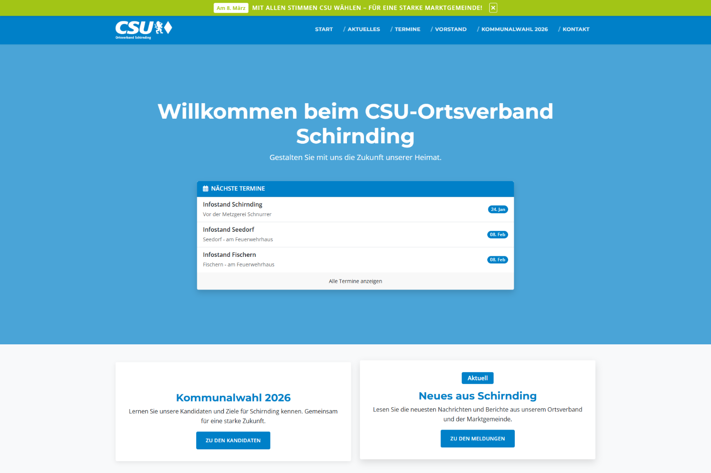

# Hugo Theme: CSU-Lite

Ein sauberes, modernes und konfigurierbares Hugo-Theme, das für CSU-Ortsverbände oder andere politische Organisationen entwickelt wurde. Das Design ist von der offiziellen Webseite `csu.de` inspiriert.



## Funktionen

*   **Modernes & responsives Design:** Optimiert für alle Geräte.
*   **Umfangreich konfigurierbar:** Texte und Einstellungen via `hugo.toml`.
*   **Datengesteuert:** Kandidaten, Vorstand und Schwerpunkte werden einfach über YAML-Dateien gepflegt.
*   **Spezialseiten:**
    *   **Kommunalwahl:** Mit Kandidatenvorstellung, persönlichem Brief, Schwerpunkten und Sprungmenü.
    *   **Fraktion:** Bereich für Berichte aus dem Gemeinderat/Stadtrat (konfigurierbar).
*   **Features:**
    *   Globaler "Wahl-Störer" (Top-Bar).
    *   Automatische Termin-Box auf der Startseite.
    *   Highlight-Box auf der Startseite.
    *   Integriertes Kontaktformular (via Formspree).

## Installation & Verwendung

### 1. Theme installieren

Der empfohlene Weg ist die Installation als Git Submodule. So kannst du das Theme einfach aktualisieren.

Führe folgenden Befehl im Hauptverzeichnis deiner Hugo-Webseite aus:

```bash
git submodule add https://github.com/DEIN-USERNAME/csu-lite.git themes/csu-lite
```

*(Ersetze `https://github.com/DEIN-USERNAME/csu-lite.git` mit der tatsächlichen URL dieses Repositories)*

Alternativ kannst du das Theme auch herunterladen und manuell in den `themes/`-Ordner entpacken.

### 2. Beispielinhalte nutzen (Schnellstart)

Das Theme enthält einen `exampleSite`-Ordner mit einer vollständigen Konfiguration und Beispielinhalten. Um schnell zu starten, kopiere den Inhalt dieses Ordners in dein Projektverzeichnis:

**Achtung: Dies überschreibt vorhandene Dateien!**

1.  Kopiere `themes/csu-lite/exampleSite/hugo.toml` in dein Hauptverzeichnis.
2.  Kopiere den Inhalt von `themes/csu-lite/exampleSite/content/` in deinen `content/`-Ordner.
3.  Kopiere den Inhalt von `themes/csu-lite/exampleSite/data/` in deinen `data/`-Ordner.
4.  Kopiere den Inhalt von `themes/csu-lite/exampleSite/static/` in deinen `static/`-Ordner.

### 3. Konfigurieren

Öffne die `hugo.toml` in deinem Hauptverzeichnis und passe die Einstellungen an deine Bedürfnisse an (Titel, URLs, Texte, etc.).

### 4. Starten

Starte den Hugo-Server:

```bash
hugo server
```

## Konfiguration (`hugo.toml`)

### Homepage (`[params.homepage]`)
```toml
[params.homepage]
  heroTitle = "Willkommen..."
  heroSubtitle = "Gestalten Sie..."
  newsTitle = "Aktuelles aus dem Ortsverband"
  teamTitle = "Unsere Köpfe"
  teamButtonText = "Unser Team"
  teamImage = "images/team.jpg"
  teamImageAlt = "Unser Team"

  [params.homepage.highlightBox]
    enabled = true
    title = "Kommunalwahl 2026"
    content = "Lernen Sie unsere Kandidaten kennen..."
    url = "/kommunalwahl-2026/"
    linkText = "Zu den Kandidaten"
```

### Globaler Wahl-Störer (`[params.election]`)
```toml
[params.election]
  enabled = true
  date = "Am 8. März"
  text = "CSU wählen!"
  icon = "fas fa-times"
```

### Kontaktformular (`[params.contact]`)
```toml
[params.contact]
  formspreeID = "deine-formspree-id" # Erstelle ein Formular auf formspree.io
```

### Kommunalwahl (`[params.kommunalwahl]`)
```toml
[params.kommunalwahl]
  mayorCandidateTitle = "Unser Bürgermeisterkandidat"
  countyCandidateTitle = "Unsere Kandidatin für den Kreistag"
  localCandidatesTitle = "Unsere Kandidaten für den Gemeinderat"
  goalsTitle = "Unsere Schwerpunkte"
```

### Datenschutz (`[privacy]`)
Um externe Verbindungen (z.B. YouTube, Vimeo) datenschutzkonform zu laden:

```toml
[privacy]
  [privacy.vimeo]
    disabled = false
    simple = true
    enableDNT = true
  [privacy.twitter]
    disabled = false
    simple = true
    enableDNT = true
  [privacy.youtube]
    disabled = false
    privacyEnhanced = true
```

## Daten-Management (`data/`)

Inhalte werden zentral im `data`-Verzeichnis verwaltet:

*   **`vorstand.yml`:** Liste der Vorstandsmitglieder.
*   **`gemeinderat.yml`:** Gemeinderatskandidaten (Name, Bild, Listenplatz, Beruf, Alter, Zitat).
*   **`kreistag.yml`:** Kreistagskandidaten.
*   **`buergermeister.yml`:** Bürgermeisterkandidat.
*   **`schwerpunkte.yml`:** Politische Ziele mit Icons.

## Inhaltstypen

*   **Aktuelles:** `content/aktuelles/`. Setze `type: aktuelles` im Frontmatter.
*   **Termine:** `content/termine/`.
    *   **Wichtig:** Nutze das Feld `eventDate` für das tatsächliche Datum (Format: `YYYY-MM-DDTHH:MM:SS+ZZ:ZZ`).
    *   Setze das Standard-`date` Feld auf ein Datum in der Vergangenheit (z.B. 2000), damit Hugo die Seite immer baut.
*   **Fraktion:** `content/fraktion/`.
    *   Setze `draft: false` in `_index.md` zum Veröffentlichen.
    *   Beiträge können `label: "Fraktion"` oder `label: "Bürgermeister"` haben.
*   **Kommunalwahl:** `content/kommunalwahl-2026.md`. Der Textkörper dieser Datei wird als "Persönlicher Brief" angezeigt.

## Theme-Entwicklung & Screenshots

Wenn du das Theme weiterentwickelst oder in der Hugo Theme Registry veröffentlichen möchtest, beachte bitte folgende Bildanforderungen im `images/`-Ordner des Themes:

*   **`screenshot.png` (1500x1000px):** Ein großer, repräsentativer Screenshot der Startseite.
*   **`tn.png` (900x600px):** Ein Thumbnail (Vorschaubild) für die Galerieansicht. Dies sollte ein gut erkennbarer Ausschnitt oder eine verkleinerte Version sein.

## Lizenz

Apache License 2.0
Copyright 2026
